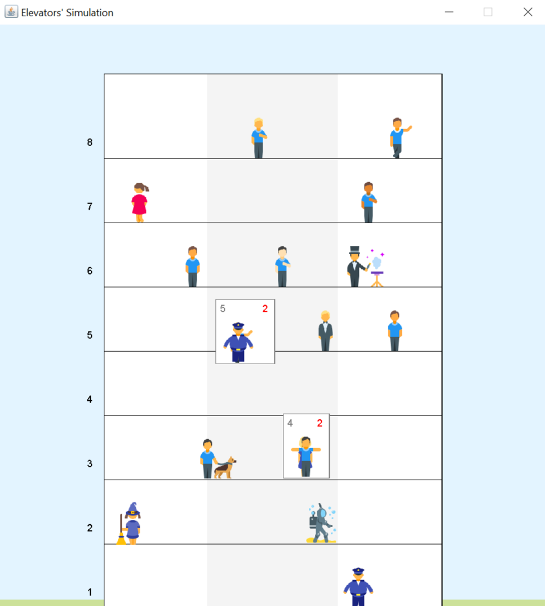

# Simulates elevators' execution in a skyscraper

_Currently works with 2 elevators (may be changed)._

_**Icons source:** <a target="_blank" href="https://icons8.com">Icons8</a>._

### How orders are being processed?

This algorithm attempts to minimize mileage and waiting time, but doesn't guarantee the best solution.

1. An elevator tries to take an order from the orders' queue.
2. If succeeds, defines speed according to order's target.
3. Goes with defined speed to the targeted floor, processes people on floors by the way:
    - floor's order removed from the queue
    - if person's destination floor is reached, it leaves
    - if directions match, people are taken from the floor
    - target floor is updated according to people's inside an elevator wonders
    - if floor is not empty, floor's order is added to the queue
4. If target is achieved:
    - if current floor is not empty, the most early person enters an elevator and defines its direction
    - otherwise return to point 1.

### Four classes provided:

- Person

  *Defines a person: its image, unique speed, wondered floor, current position.*
- Elevator

  *Defines an elevator: its size, speed, position, targeted floor, etc.*
- ElevatorActive

  *Provides elevator's logic. **Runnable.***
- Skyscraper

  *Defines a house, provides house's logic. **Runnable.***

### Functionality:

- you may define custom parameters of simulation in `Main.java` file:

    - custom house's number of floors (**check window parameters before changing**);

    - custom FPS;

    - custom title of the window;

    - custom maximum people per floor.
- generates people with random orders on floors of many-floored house.
- attempts to minimize waiting time and total elevators' mileage.

### Warnings:

- Be careful while changing `/people` folder.

    - *Check if images' names satisfy sequence `0.png` - `n.png` for n images in a folder.*
    - *If images number was changed, set the correct number in class Person.*
- Check window size if number of floors is changed.